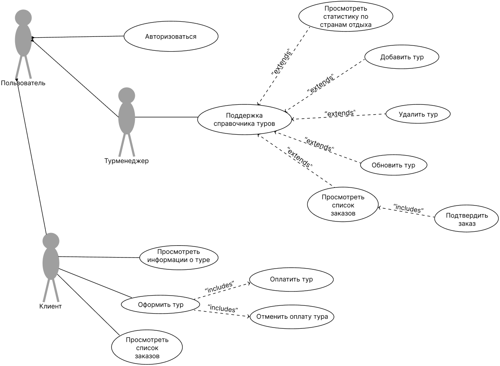
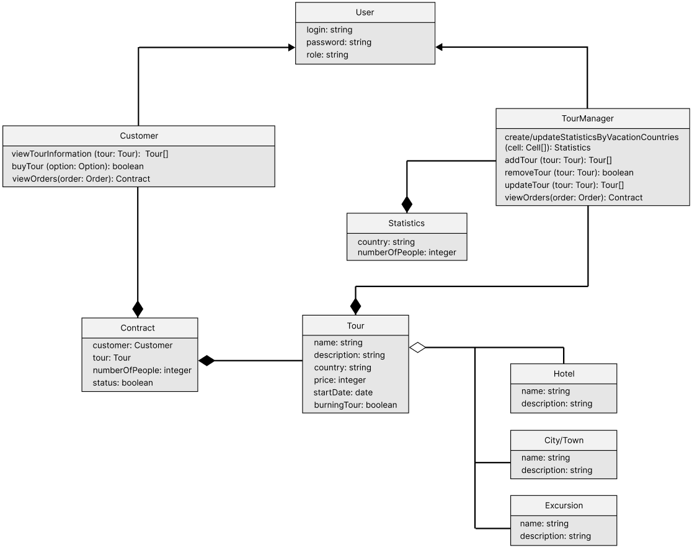
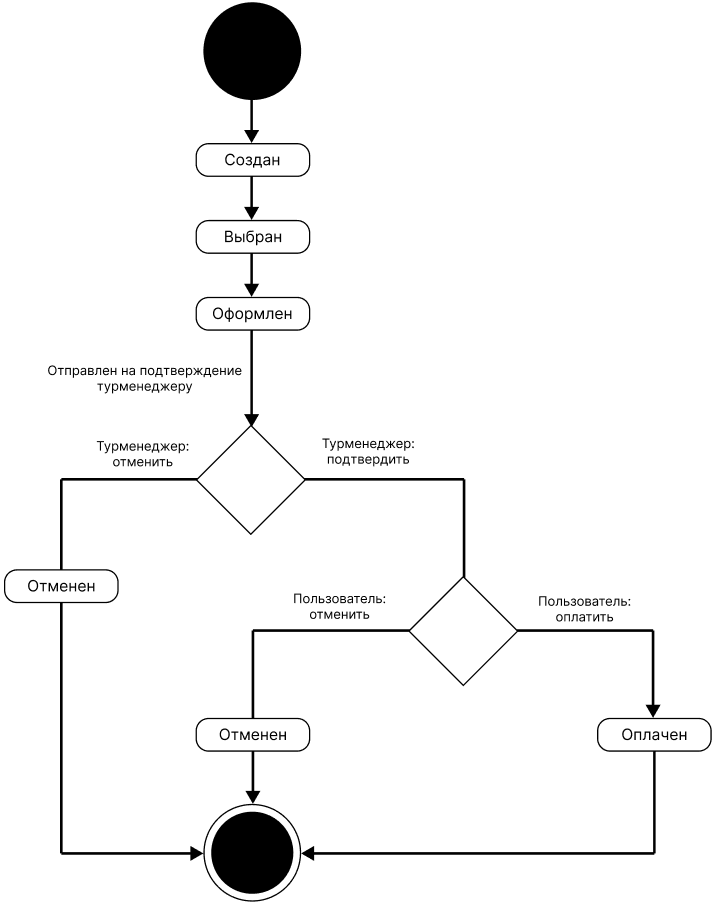
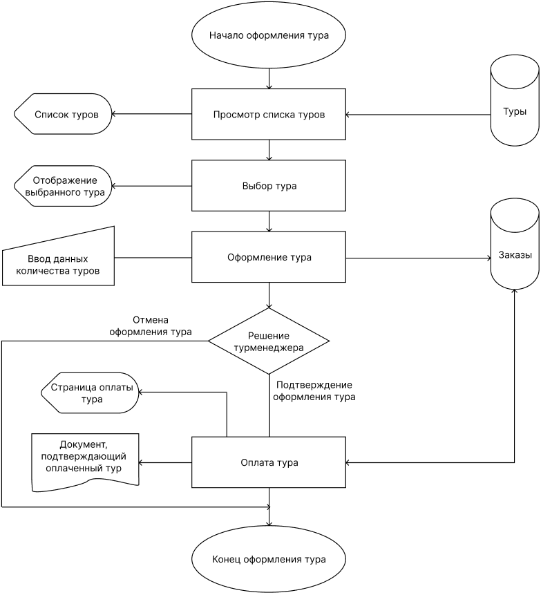
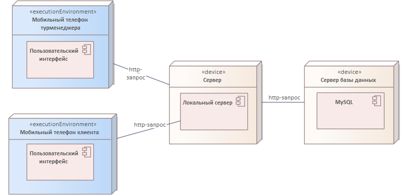
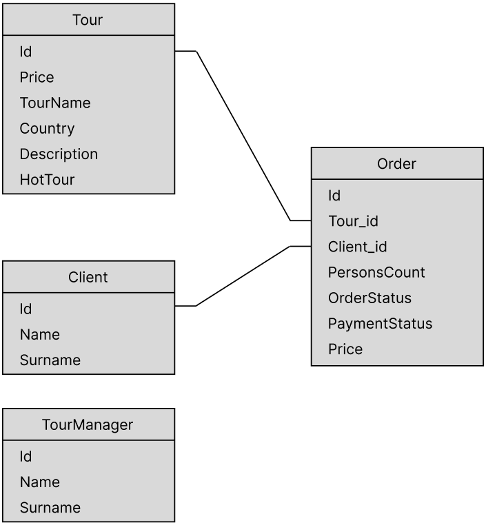

# Диаграммы и схемы

| **Название диаграммы**        | **Изображение**                                               |
|-------------------------------|--------------------------------------------------------------|
| Диаграмма прецедентов          |        |
| Диаграмма классов              |              |
| Диаграмма состояния объекта "Тур" |          |
| Схема работы системы           |         |
| Диаграмма развертывания         |   |
| Схема базы данных              |            |

> _Примечание_: Все изображения диаграмм расположены в папке **`/images`**.